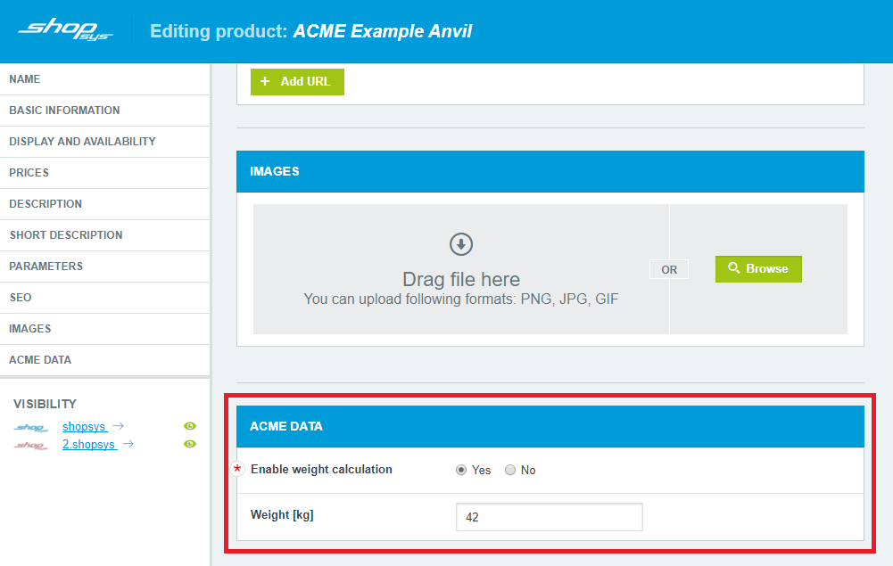

# General Shopsys Framework Plugin Interface
Package of interfaces providing compatibility between [Shopsys Framework](https://www.shopsys-framework.com) and plugins.

## Features
This package contains interfaces responsible for general functionality usable in almost any plugin.
For specific functionality, such as generating product feeds, there are [separate repositories](https://github.com/search?q=topic%3Aplugin-interface+org%3Ashopsys&type=Repositories), eg. [ProductFeedInterface](https://github.com/shopsys/product-feed-interface/).

### Data storage
A lot of plugins need to persist some kind of custom data, for example, the last time a command was executed.

For this task you can use [`DataStorageInterface`](./src/DataStorageInterface.php) that has all the methods you need.
You can safely persist scalar values or arrays in a key-value storage fashion.

To get the instance of the data storage you can call `getDataStorage()` method on a service from Shopsys Framework implementing [`PluginDataStorageProviderInterface`](./src/PluginDataStorageProviderInterface.php).

See [`\Shopsys\Plugin\DataStorageInterface`](./src/DataStorageInterface.php) and [`\Shopsys\Plugin\PluginDataStorageProviderInterface`](./src/PluginDataStorageProviderInterface.php) for details.

#### Example
For example usage see the `AcmeProductCrudExtension` in the CRUD extension section below.

### CRUD extension
Sometimes your plugin needs some extra information to be included in an entity, for example, you need to track the weight of products.
This can be solved by extending the entity CRUD model with your custom sub-form.

To do so you should implement [`PluginCrudExtensionInterface`](./src/PluginCrudExtensionInterface.php) and [tag the service in a DI container](http://symfony.com/doc/current/service_container/tags.html) with `shopsys.crud_extension` tag.
The tag should have a `type` attribute defining which CRUD model should be extended (eg. `"product"`).

Each form extension has its label, form type and methods for managing the form data.

#### Example
```yaml
services:
  acme.acme_product_crud_extension:
    class: AcmePlugin\AcmeProductCrudExtension
    tags:
      - { name: shopsys.crud_extension, type: product }

  acme.acme_data_form_type:
    class: AcmePlugin\AcmeProductFormType
    tags:
      - { name: form.type }
```

```php
<?php

// ...
class AcmeProductCrudExtension implements PluginCrudExtensionInterface
{
    private $pluginDataStorage;

    public function __construct(PluginDataStorageProviderInterface $pluginDataStorageProvider) {
        $this->pluginDataStorage = $pluginDataStorageProvider->getDataStorage(AcmePluginBundle::class, 'product');
    }

    public function getFormTypeClass()
    {
        return AcmeProductFormType::class;
    }

    public function getFormLabel()
    {
        return 'ACME data';
    }

    public function getData($productId)
    {
        return $this->pluginDataStorage->get($productId);
    }

    public function saveData($productId, $data)
    {
        $this->pluginDataStorage->set($productId, $data);
    }

    public function removeData($productId)
    {
        $this->pluginDataStorage->remove($productId);
    }
}
```



## Demo Data
In order to enable easy testing or to demonstrate usage of your plugin, you might want to provide demonstrational data with it.
In that case, you should implement [`PluginDataFixtureInterface`](./src/PluginDataFixtureInterface.php) that will take care of loading demonstrational data into the core.

All you got to do is to implement `PluginDataFixtureInterface::load()` method, 
where you must set data using [the plugin data storage](#data-storage) and [tag the service in a DI container](http://symfony.com/doc/current/service_container/tags.html) with `shopsys.data_fixture` tag.

#### Example
```yaml
services:
  acme.acme_bundle.data_fixture:
    class: AcmePlugin\AcmeDataFixture
    tags:
      - { name: shopsys.data_fixture }
```

```php
<?php

class AcmeDataFixture implements PluginDataFixtureInterface
{
    /**
     * @var \Shopsys\Plugin\PluginDataStorageInterface
     */
    private $pluginDataStorage;

    public function __construct(PluginDataStorageProviderInterface $pluginDataStorageProvider) {
        $this->pluginDataStorage = $pluginDataStorageProvider->getDataStorage(AcmePluginBundle::class, 'product');
    }

    public function load() {
        $this->productDataStorage->set(1, [
            'enable_weight_calculation' => true,
            'weight' => 42,
        ]);

        $this->productDataStorage->set(2, [
            'enable_weight_calculation' => false,
            'weight' => null,
        ]);
    }

}
```

## How to implement a plugin
Plugins are implemented in a form of a [Symfony bundle](http://symfony.com/doc/current/bundles.html).
For tips on how to write a new bundle see [Best Practices for Reusable Bundles](https://symfony.com/doc/current/bundles/best_practices.html).
